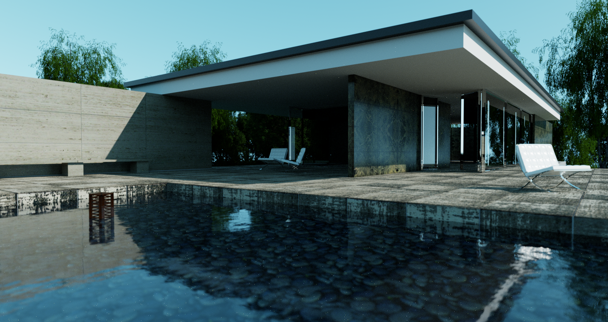
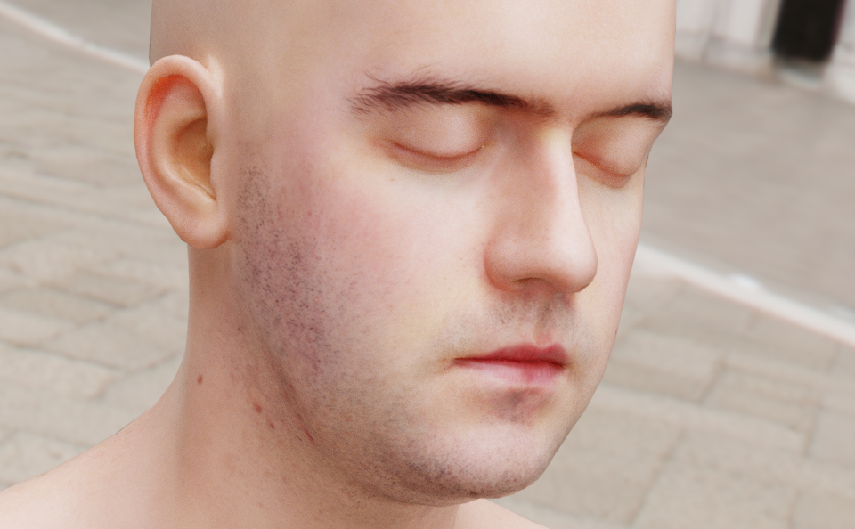
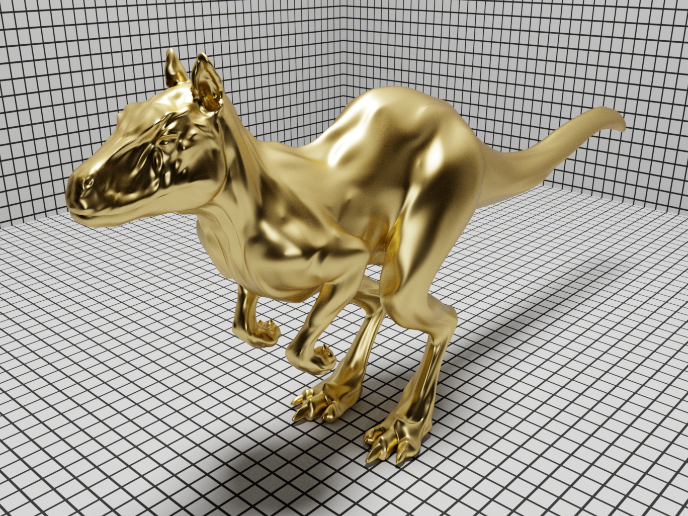
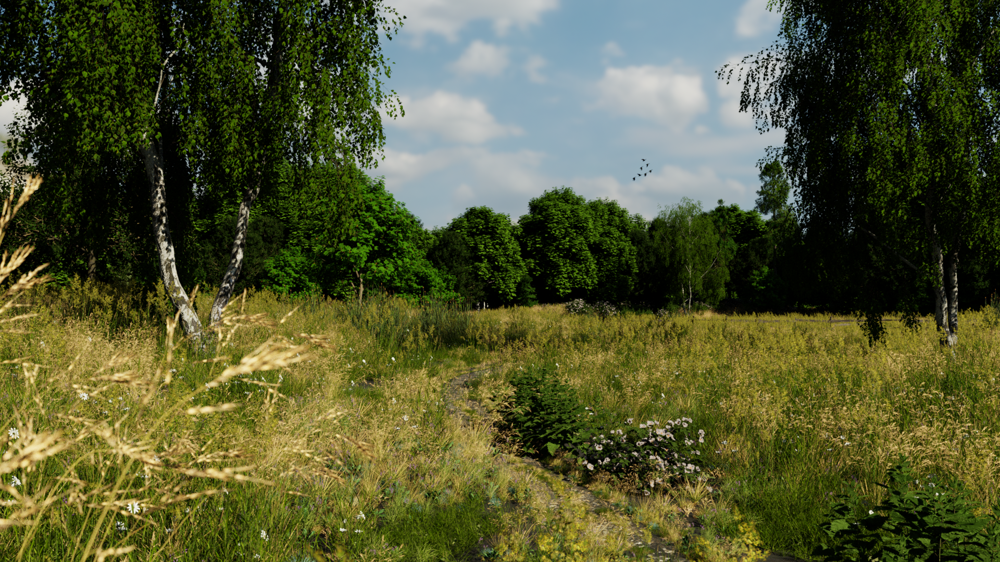
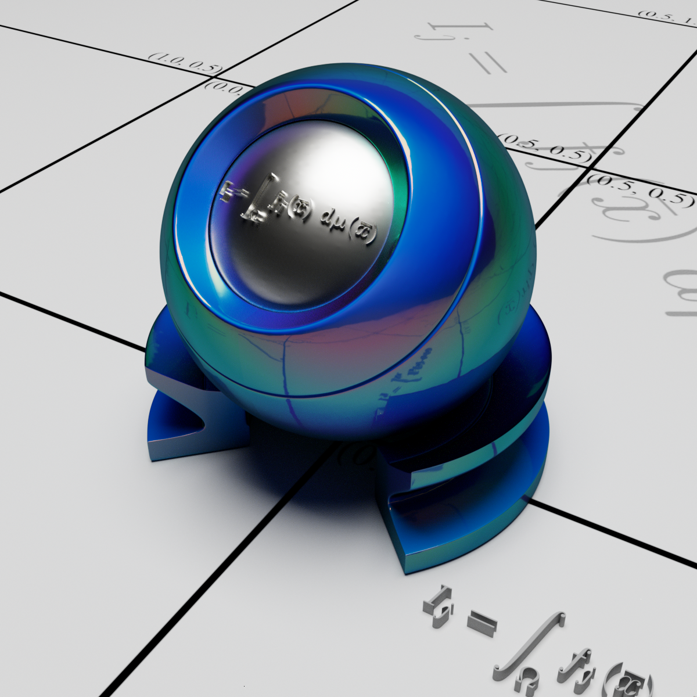
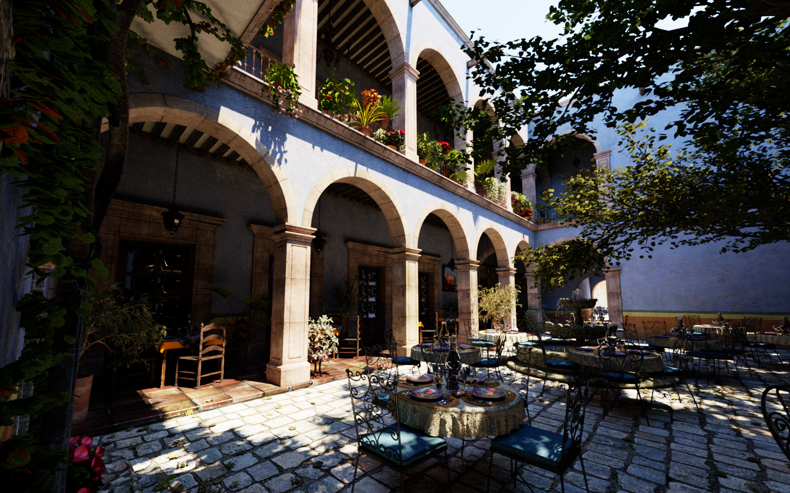
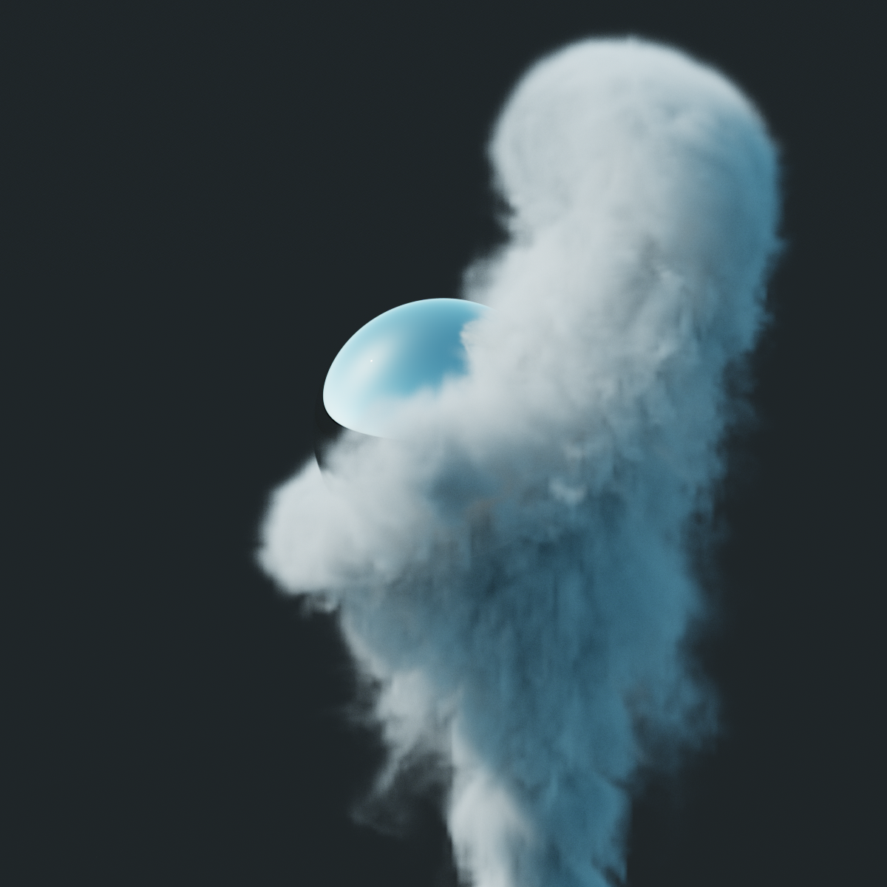
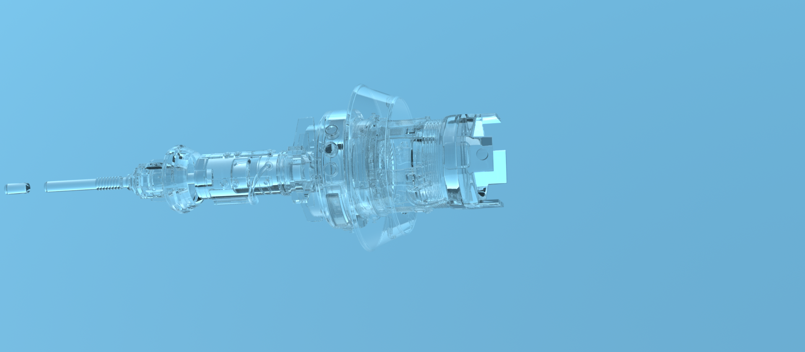
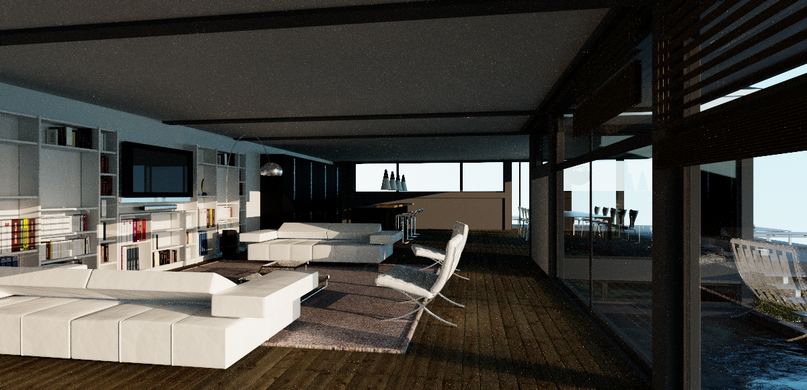

This repository provides the following scenes for use with
[pbrt-v4](https://github.com/mmp/pbrt-v4). We will be adding more scenes in
the coming weeks and would happily accept contributions of additional ones!

## Barcelona Pavilion 

[barcelona-pavilion/](tree/master/barcelona-pavilion/)

A model of van der Rohe's classic [Barcelona
Pavilion](https://en.wikipedia.org/wiki/Barcelona_Pavilion), including both
daytime and nighttime lighting setups. In the daytime setup, all
illumination comes from a realistic sky model encoded in an HDR environment
map. The night model has a very dark sky map and a number of area light
sources; it is particularly challenging to render, as much of the
illumination travels through one or more layers of glass before hitting a
surface.

Thanks to [Hamza Cheggour](http://www.emirage.org), who created this [great
model](http://www.emirage.org/2013/04/24/free-download-archviz-project-pabellon-barcelona-3d-scene-v1-2-updated/)
and made it available via a
[CC-BY](https://creativecommons.org/licenses/by/2.0/) license.

## Head

[head/](tree/master/head/)

Human head model with a realistic BSSRDF, showing the effect of
subsurface scattering.

Model thanks to Infinite Realities, Inc.,
[CC-BY](https://creativecommons.org/licenses/by/2.0/) license.  Environment
map thanks to [USC-ICT light probe image
gallery](http://gl.ict.usc.edu/Data/HighResProbes/).

## Killeroos

[killeroos/](tree/master/killeroos/)

The classic "killeroo" model, with a variety of materials and in a variety
of settings.

Thanks to [headus](http://www.headus.com/au)/Rezard for the model.

## Landscape

[landscape/](tree/master/landscape/)

Complex realistic outdoor landscape scene,
featuring 23,241 unique plant models.  Thanks to object instancing, the
scene has a total geometric complexity of 3.1 billion triangles, even
though only 24 million triangles need to be stored in memory. `view-0.pbrt`
is the cover image of the third edition of the _Physically Based Rendering_
book.

Many thanks to Jan-Walter Schliep, Burak Kahraman, and Timm
Dapper from [Laubwerk](http://www.laubwerk.com) for this amazing scene.

## LTE Orb

[lte-orb/](tree/master/lte-orb/)

Spherical orb with an inset spherical object. The
geometric structure of the shapes involved provides a useful tool for
visualizing the appearance of various materials.

Thanks to Yasutoshi Mori (@MirageYM) for this model;
[CC-BY](https://creativecommons.org/licenses/by/2.0/) license.

## San Miguel

[sanmiguel/](tree/master/sanmiguel/)

A complex model inspired by a hotel in San Miguel de
Allende, Mexico.

Thanks to Guillermo M. Leal Llaguno for this excellent scene.

## Smoke Plume

[smoke-plume/](tree/master/smoke-plume/)

A smoke simulation around an obstacle using volume data generated using the
simulator published with Kim et al.'s [Wavelet Turbulence for Fluid
Simulation](https://www.cs.cornell.edu/~tedkim/wturb/) paper.

## Sportscar

[sportscar/](tree/master/sportscar/)

Sportscar model, where nearly every surface uses a measured BRDF from the
[RGL Material Database](http://rgl.epfl.ch/materials).

This excellent model and pbrt conversion courtesy of Yasutoshi Mori (@MirageYM);
[CC-BY](https://creativecommons.org/licenses/by/2.0/) license.

## Transparent Machines

[transparent-machines/](tree/master/transparent-machines/)

A variety of detailed glass shapes illuminated by skylight. For good
results, upwards of 64 ray bounces are required.

Models are from frames of [@beeple](http://beeple-crap.com)'s amazing
[Transparent Machines
video](https://vimeo.com/78716671).

[License](http://beeple-crap.com/resources.php).

## Villa

[villa/](tree/master/villa/)

Modern indoor environment.

Many thanks to Florent Boyer for this scene.

## Zero Day

[zero-day/](tree/master/zero-day/)

A number of frames converted from Beeple's amazing
[Zero-Day](https://vimeo.com/140163198) animation. Converted from Cinema4D
files downloaded from [Beeple's
website](http://www.beeple-crap.com/resources.php). (Note that the original
materials and lighting is much better--improvements to our conversion
gratefully received!)

[License](http://beeple-crap.com/resources.php).
