This repository provides the following scenes for use with
[pbrt-v4](https://github.com/mmp/pbrt-v4). We will be adding more scenes in
the coming weeks and would happily accept contributions of additional ones!

## Barcelona Pavilion 

[barcelona-pavilion/](https://github.com/mmp/pbrt-v4-scenes/tree/master/barcelona-pavilion/)

A model of van der Rohe's classic [Barcelona
Pavilion](https://en.wikipedia.org/wiki/Barcelona_Pavilion), including both
daytime and nighttime lighting setups. In the daytime setup, all
illumination comes from a realistic sky model encoded in an HDR environment
map. The night model has a very dark sky map and a number of area light
sources; it is particularly challenging to render, as much of the
illumination travels through one or more layers of glass before hitting a
surface.

Thanks to [Hamza Cheggour](http://www.emirage.org), who created this [great
model](http://www.emirage.org/2013/04/24/free-download-archviz-project-pabellon-barcelona-3d-scene-v1-2-updated/)
and made it available via a
[CC-BY](https://creativecommons.org/licenses/by/2.0/) license.

## Bistro

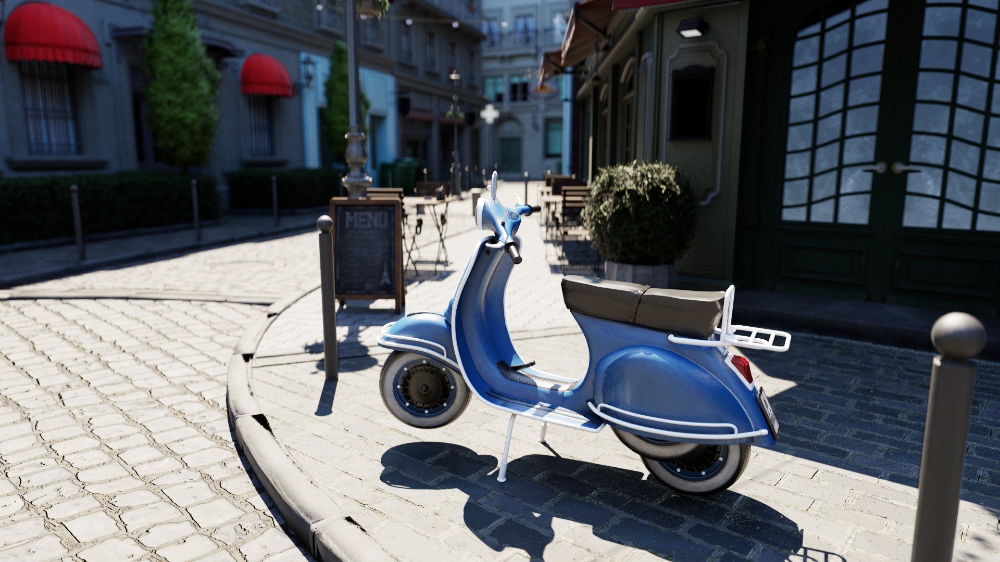

[bistro/](https://github.com/mmp/pbrt-v4-scenes/tree/master/bistro/)

Amazon Lumberyard's "Bistro" model, featuring a detailed model of a
Parisian street.  This model is via NVIDIA's [Open Research Content Archive
(ORCA)](http://developer.nvidia.com/orca/amazon-lumberyard-bistro) and is
licensed under a [CC-BY](https://creativecommons.org/licenses/by/4.0/)
license.

## Bunny Cloud

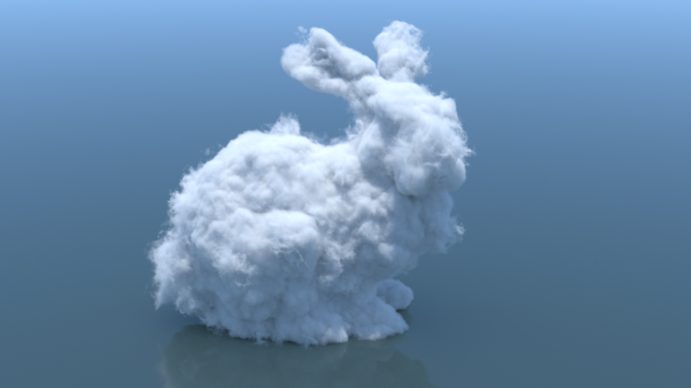

[bunny-cloud/](https://github.com/mmp/pbrt-v4-scenes/tree/master/bunny-cloud/)

The classic Stanford bunny model, remade using volumetric media to give it
a cloud-like appearance.  The bunny is stored in a NanoVDB volume that was
converted from an OpenVDB volume from the [OpenVDB
repository](https://www.openvdb.org/download/).

## Contemporary Bathroom

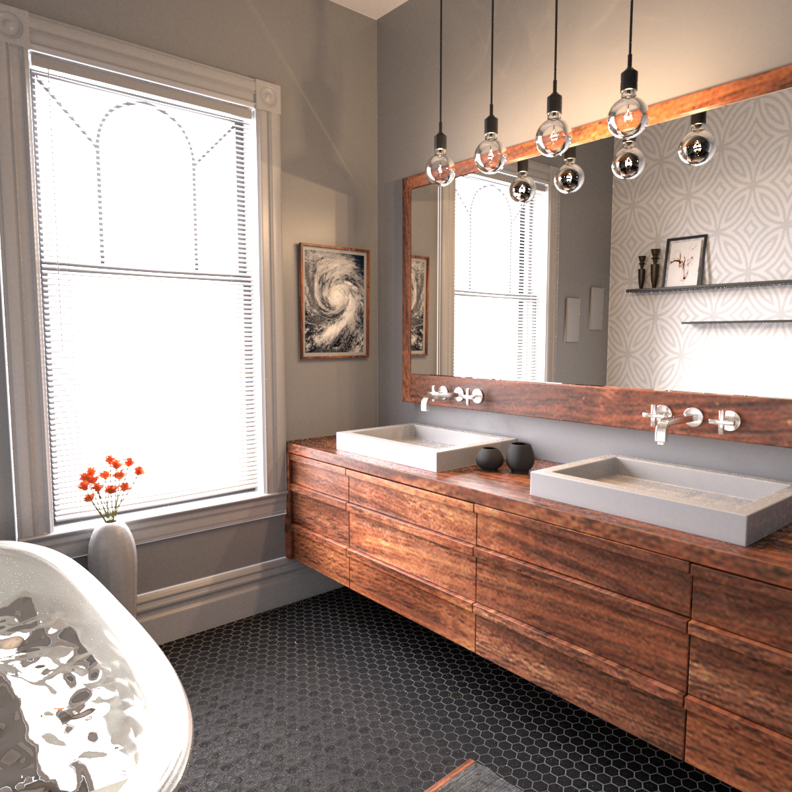

[contemporary-bathroom/](https://github.com/mmp/pbrt-v4-scenes/tree/master/contemporary-bathroom/)

A model of a contemporary bathroom, courtesy of Mareck via [BlendSwap](https://www.blendswap.com/blend/13303). [CC Zero](http://creativecommons.org/publicdomain/mark/1.0/) (Public Domain) license.

## Crown

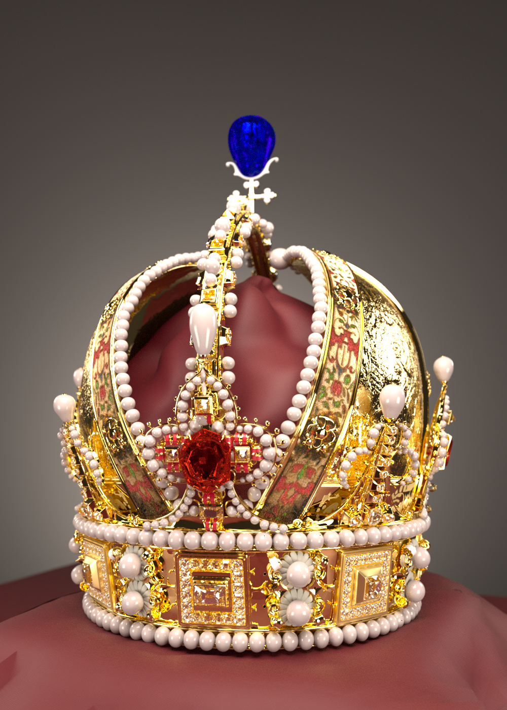

[crown/](https://github.com/mmp/pbrt-v4-scenes/tree/master/crown/)

Detailed model of the Austrian Imperial Crown, featuring an accurate
reflection model for the gold metal surfaces, and many gems that refract
light passing through them.

This amazing model was created by Martin Lubich (http://www.loramel.net/).

## Dam Break

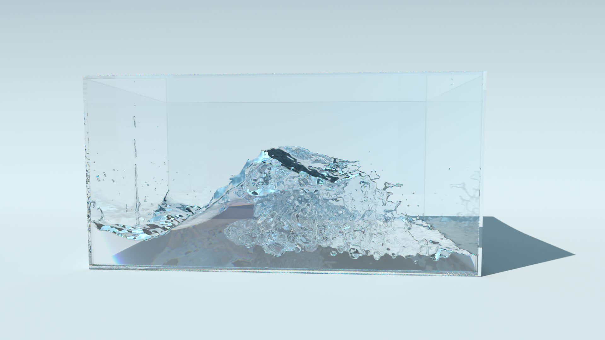

[dambreak/](https://github.com/mmp/pbrt-v4-scenes/tree/master/dambreak/)

Two frames of a fluid simlulation from [Yining Karl
Li](http://www.yiningkarlli.com)'s nifty [Ariel fluid
simulator](http://www.yiningkarlli.com/projects/arielflip.html).

## Disney Cloud

[disney-cloud/](https://github.com/mmp/pbrt-v4-scenes/tree/master/disney-cloud/)

The cloud from the dataset provided by Disney ([see here](https://disney-animation.s3.amazonaws.com/uploads/production/data_set_asset/1/asset/Cloud_Readme.pdf)).

The original dataset includes the HD render computed with Disney's
Hyperion, and the cloud density field voxelized at different resolutions
and stored in OpenVDB volumes.  It also includes a Mitsuba scene
description file and the associated SD render computed with it.  The
original dataset is Copyright 2017 Disney Enterprises, Inc. and is licensed
under the [CCA-SA 3.0
Licence](http://creativecommons.org/licenses/by-sa/3.0/).  The volumetric
cloud model used for reference is a photograph by Kevin Udy provided on
[the Colorado Clouds Blog](https://coclouds.com/436/cumulus/2012-07-26/)
and licensed under the [CCA-SA 3.0
Licence](http://creativecommons.org/licenses/by-sa/3.0/).

The voxelized density field is stored in a NanoVDB volume that was
converted from the OpenVDB "quarter" resolution volume due to github's
limitations on file size; it can easily be replaced with higher-resolution
versions downloaded from [Disney's
website](https://www.disneyanimation.com/data-sets/?drawer=/resources/clouds/).

## Explosion

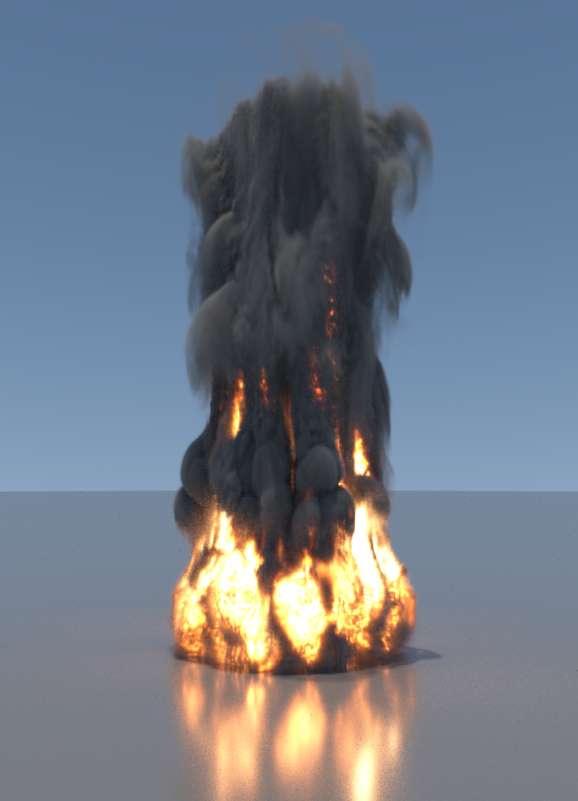

[explosion/](https://github.com/mmp/pbrt-v4-scenes/tree/master/explosion/)

A volumetric fiery explosion, stored in a NanoVDB volume that was converted
from an OpenVDB volume from the [OpenVDB
repository](https://www.openvdb.org/download/).

## Ganesha

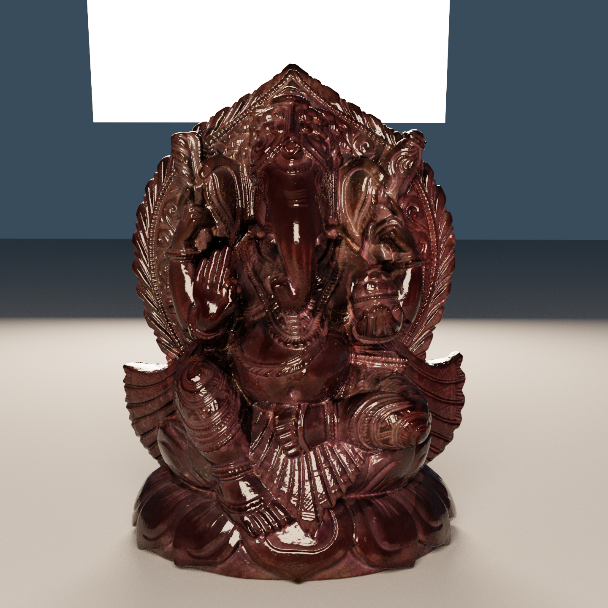

[ganesha/](https://github.com/mmp/pbrt-v4-scenes/tree/master/ganesha/)

Very detailed scan of a small statue with over 4.3
million triangles, illuminated by a few area light sources.

Model scanned by Wenzel Jakob.

## Head

[head/](https://github.com/mmp/pbrt-v4-scenes/tree/master/head/)

Human head model with a realistic BSSRDF, showing the effect of
subsurface scattering.

Model thanks to Infinite Realities, Inc.,
[CC-BY](https://creativecommons.org/licenses/by/2.0/) license.  Environment
map thanks to [USC-ICT light probe image
gallery](http://gl.ict.usc.edu/Data/HighResProbes/).

## Killeroos

[killeroos/](https://github.com/mmp/pbrt-v4-scenes/tree/master/killeroos/)

The classic "killeroo" model, with a variety of materials and in a variety
of settings.

Thanks to [headus](http://www.headus.com/au)/Rezard for the model.

## Landscape

[landscape/](https://github.com/mmp/pbrt-v4-scenes/tree/master/landscape/)

Complex realistic outdoor landscape scene,
featuring 23,241 unique plant models.  Thanks to object instancing, the
scene has a total geometric complexity of 3.1 billion triangles, even
though only 24 million triangles need to be stored in memory. `view-0.pbrt`
is the cover image of the third edition of the _Physically Based Rendering_
book.

Many thanks to Jan-Walter Schliep, Burak Kahraman, and Timm
Dapper from [Laubwerk](http://www.laubwerk.com) for this amazing scene.

## LTE Orb

[lte-orb/](https://github.com/mmp/pbrt-v4-scenes/tree/master/lte-orb/)

Spherical orb with an inset spherical object. The
geometric structure of the shapes involved provides a useful tool for
visualizing the appearance of various materials.

Thanks to Yasutoshi Mori (@MirageYM) for this model;
[CC-BY](https://creativecommons.org/licenses/by/2.0/) license.

## PBRT Book

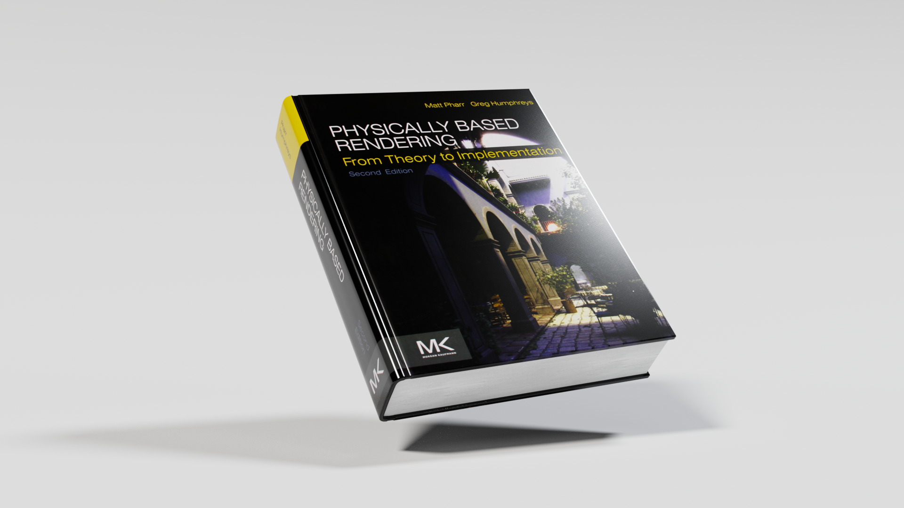

[pbrt-book/](https://github.com/mmp/pbrt-v4-scenes/tree/master/pbrt-book/)

A realistic model of the second edition of the _Physically
Based Rendering_ book.

Thanks to Karl Li (@yiningkarlli) for this fun model.

## San Miguel

[sanmiguel/](https://github.com/mmp/pbrt-v4-scenes/tree/master/sanmiguel/)

A complex model inspired by a hotel in San Miguel de
Allende, Mexico.

Thanks to Guillermo M. Leal Llaguno for this excellent scene.

## Smoke Plume

[smoke-plume/](https://github.com/mmp/pbrt-v4-scenes/tree/master/smoke-plume/)

A smoke simulation around an obstacle using volume data generated using the
simulator published with Kim et al.'s [Wavelet Turbulence for Fluid
Simulation](https://www.cs.cornell.edu/~tedkim/wturb/) paper.

## Sportscar

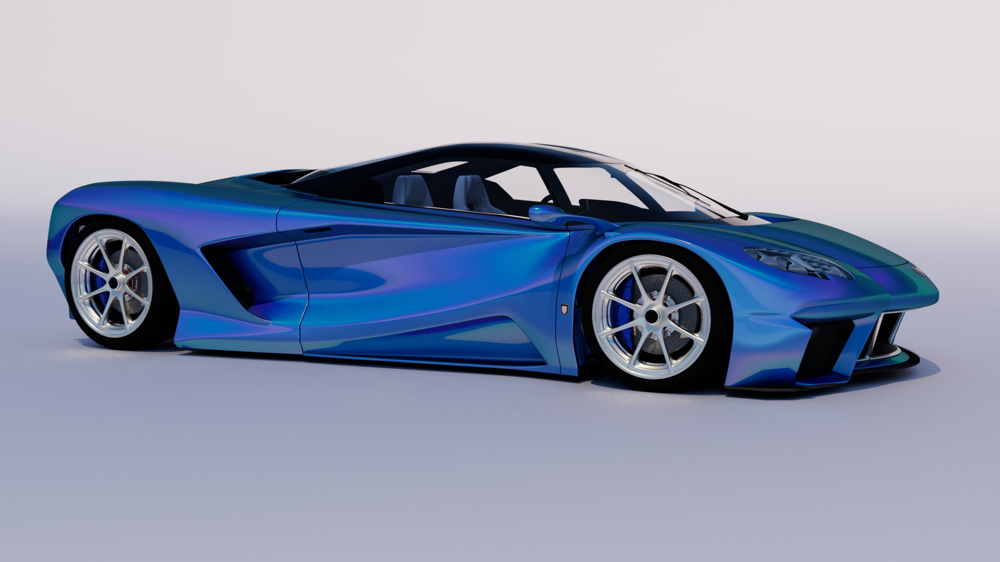

[sportscar/](https://github.com/mmp/pbrt-v4-scenes/tree/master/sportscar/)

Sportscar model, where nearly every surface uses a measured BRDF from the
[RGL Material Database](http://rgl.epfl.ch/materials).

This excellent model and pbrt conversion courtesy of Yasutoshi Mori (@MirageYM);
[CC-BY](https://creativecommons.org/licenses/by/2.0/) license.

## SSS Dragon

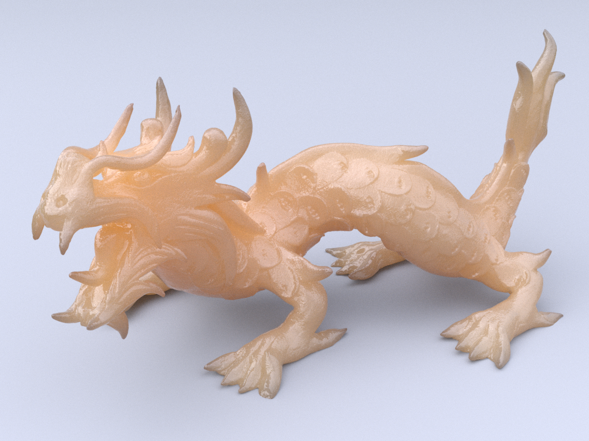

[sssdragon/](https://github.com/mmp/pbrt-v4-scenes/tree/master/sssdragon/)

Dragon model rendered with subsurface scattering, where multiple scene
description files show the visual effect of changing the density of the
scattering medium.

Dragon model courtesy [Stanford Computer Graphics
Laboratory](http://graphics.stanford.edu/data/3Dscanrep/).  Environment map
thanks to [Bernhard Vogl](http://dativ.at/lightprobes/index.html).

## Transparent Machines

[transparent-machines/](https://github.com/mmp/pbrt-v4-scenes/tree/master/transparent-machines/)

A variety of detailed glass shapes illuminated by skylight. For good
results, upwards of 64 ray bounces are required.

Models are from frames of [@beeple](http://beeple-crap.com)'s amazing
[Transparent Machines
video](https://vimeo.com/78716671).

[License](http://beeple-crap.com/resources.php).

## Villa

[villa/](https://github.com/mmp/pbrt-v4-scenes/tree/master/villa/)

Modern indoor environment.

Many thanks to Florent Boyer for this scene.

## Zero Day

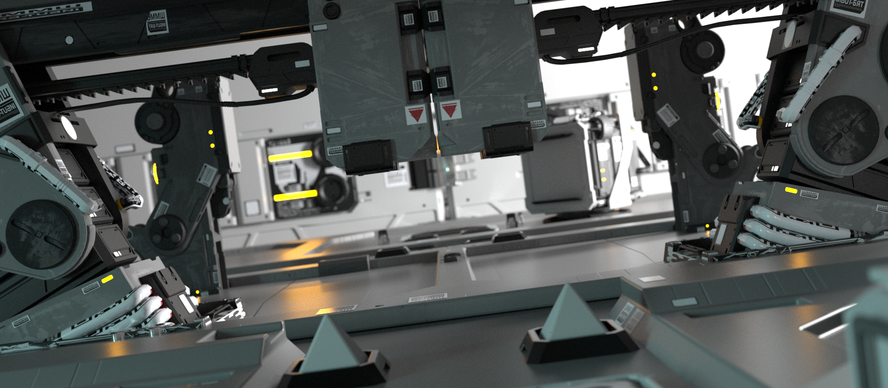

[zero-day/](https://github.com/mmp/pbrt-v4-scenes/tree/master/zero-day/)

A number of frames converted from Beeple's amazing
[Zero-Day](https://vimeo.com/140163198) animation. Converted from Cinema4D
files downloaded from [Beeple's
website](http://www.beeple-crap.com/resources.php). (Note that the original
materials and lighting is much better--improvements to our conversion
gratefully received!)

[License](http://beeple-crap.com/resources.php).
